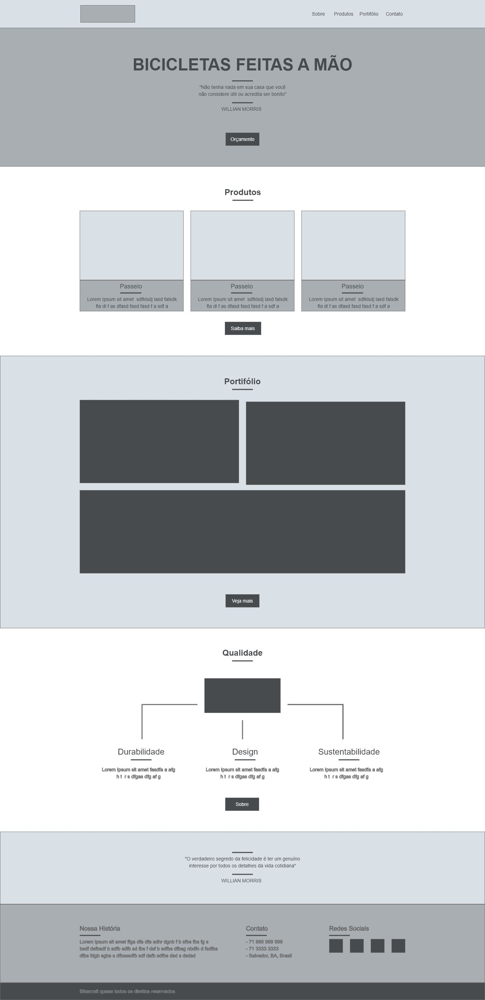
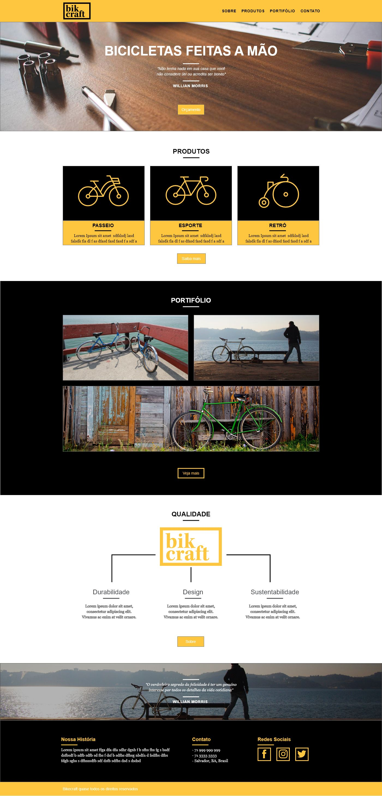

# BikeCraft
Projeto do curso de Web Design Completo ministrado pelo André Rafael na Origamid
Projeto consiste no design e codificação do site da BikCraft, empresa de venda de bicicletas customizadas

## Wireframes
Como primeiro passo, o desenvolvimento de wireframes
O da home:

E os das demais páginas:

- [Portifolio](docs/wireframe/Portifolio.jpg)
- [Produtos](docs/wireframe/Produtos.jpg)
- [Sobre](docs/wireframe/Sobre.jpg)
- [Contato](docs/wireframe/Contato.jpg)

## Design
Desenvolvimento do design final das páginas
Design final da Home:

E os das demais páginas

- [Portifolio](docs/design/Portifolio.jpg)
- [Produtos](docs/design/Produtos.jpg)
- [Sobre](docs/design/Sobre.jpg)
- [Contato](docs/design/Contato.jpg)

## Codificação
Também foi desenvolvido a responsibilidade do site.